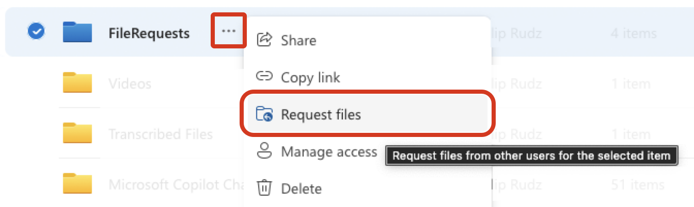
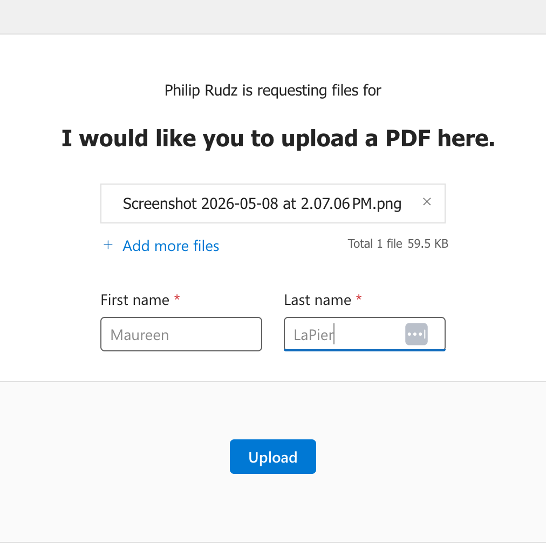

# Using OneDrive File Requests to Collect Student Work
A&S Teaching & Learning (teachinglearning.artsci@utoronto.ca)

In larger courses it may be more practical to use Microsoft OneDrive rather than email to collect student work. Microsoft OneDrive includes a “File Request” feature that allows you to distribute a ‘drop box’ link for students to upload work. The name of each student (but not their student number or UTORid) will be prepended to each file name.

> Note: Students will be asked to enter their name when submitting a file, it will not be automatically filled in for them. Request that they use their name as it appears on Quercus if possible to make it easy to identify who submitted the material. If you need an alternative submission method that ensures work is connected to a student's U of T email, create a Microsoft Form

### Key features:
* Students cannot see the contents of the folder
* Students can upload multiple files
* Students will be prompted to enter their name which will be prepended to each uploaded file
* Student can upload the same file multiple times and a number will be appended to the file name, all versions will be visible in the destination folder.

## To Set up File Requests
1. 	Navigate to https://utoronto-my.sharepoint.com/ to access your OneDrive
    * You can also get to your OneDrive from your Outlook Web Access page by clicking the ‘waffle’ icon in the top left of the interface to find OneDrive

         
2. Open the sidebar , if it not already open, and select “My Files”
    *	To open the sidebar click: 

3.	Create a new folder in OneDrive or use an existing folder into which you would like files to be added by students
4.	Click the ‘…’ menu next to the folder or right click the folder
5.	Select Request files

6.	You will be asked to provide a description of what you would like students to upload; and then prompted to either email the request directly or to copy the link and distribute it. We recommend that you copy the link and distribute it via email.

### What students will see:

### To stop accepting files:

1.	In OneDrive, select the file request folder and click the ‘…’ icon.
2.	Select Manage Access.
3.	You will see the link you have created under “Links Giving Access”
4.	Click the ‘…’ next to the link and delete it with the ‘x’

#### Additional Notes:

For more information, see Microsoft’s documentation regarding file requests.

#### Info
Contact teachinglearning.artsci@utoronto.ca for additional help.
