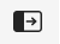
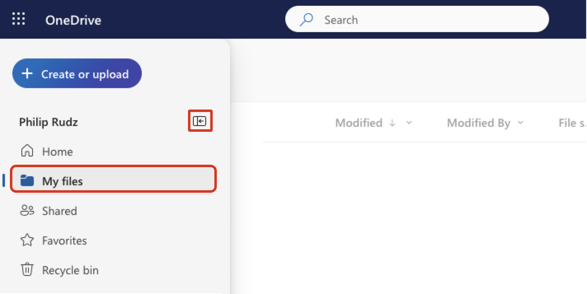
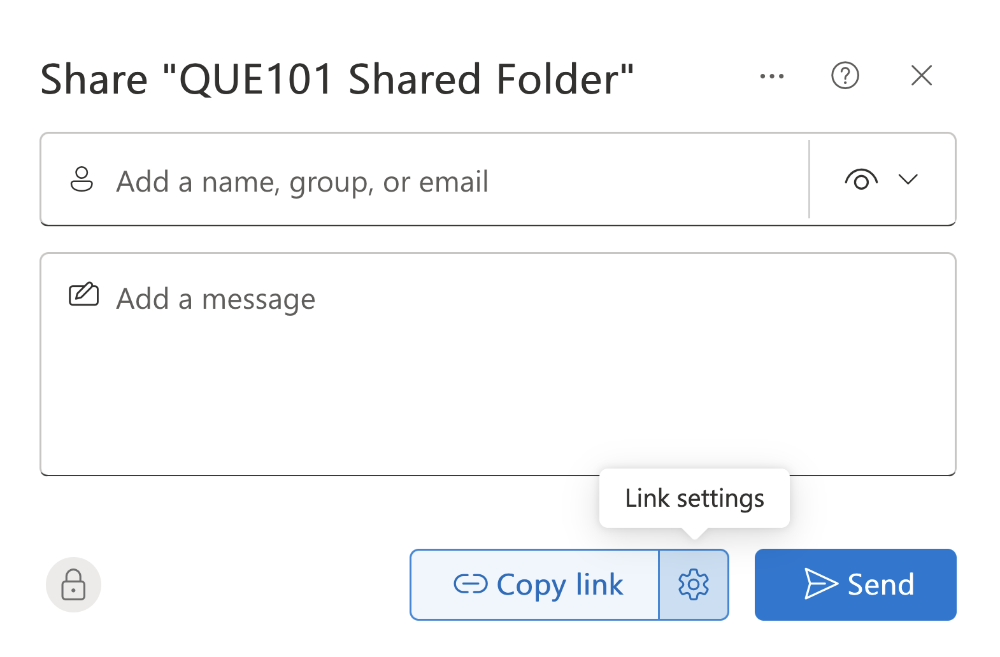
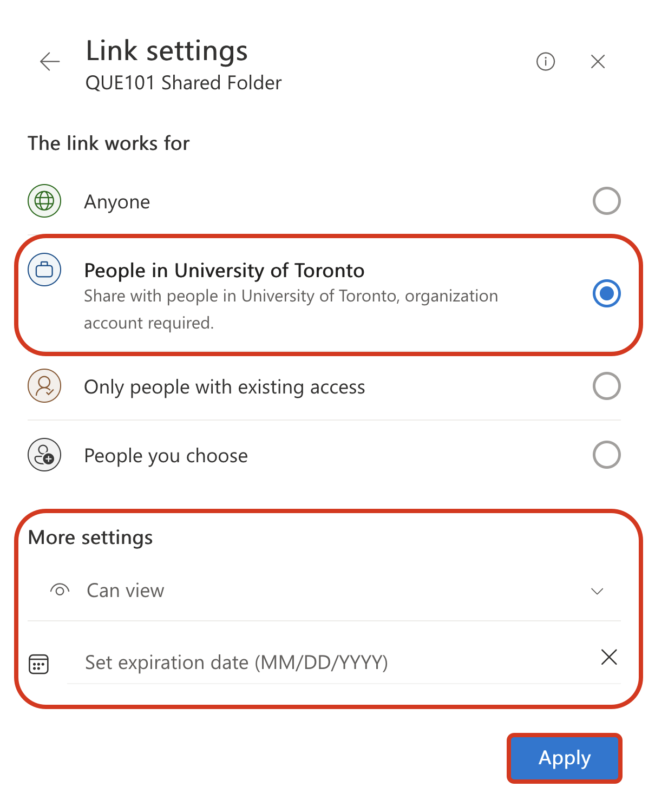
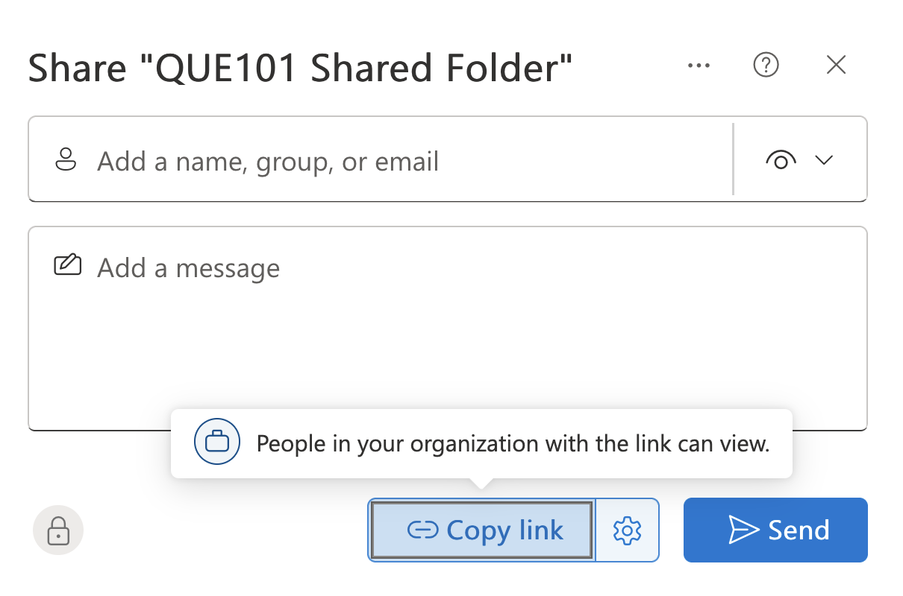
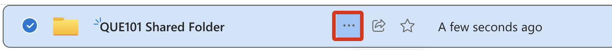
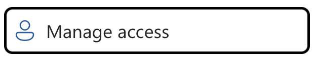
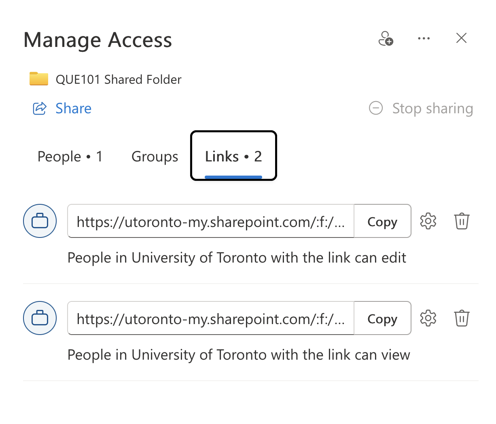

# Sharing Content Using OneDrive to U of T Users

A&S Teaching & Learning [teachinglearning.artsci@utoronto.ca](mailto:teachinglearning.artsci@utoronto.ca)

You can share content and limit access to UofT users using OneDrive. The links are accessible via UTORid authentication, and the content cannot be searched for. The links can be granted read-only or ‘edit’ access, and the same folder can have multiple links giving different permissions - for example a read-only link for students, and an edit link for TAs.

## To Share a Folder:

1.	Navigate to https://utoronto-my.sharepoint.com/ to access your OneDrive
    * You can also get to your OneDrive from your [Outlook Web Access](https://mail.utoronto.ca) page by clicking the **‘waffle’** icon in the top left of the interface to find OneDrive: 
    
        

2.	Open the sidebar, if it not already open, and select **“My Files”**
    * To open the sidebar click: 

3. Create a new folder in OneDrive or use an existing folder which you would like to share with recipients
4.	Click the **share icon** next to the folder

5.	Select “Link Settings”

6. Configure the link to be accessible to **“Anyone”**. We recommend allowing **“Can View”** access – so that your files remain read-only. You can configure an expiry of a maximum of 30 days and set a password. Because you are likely to distribute the password and link together, note that setting a password is unlikely to offer significant additional security. **Click apply**.

7. **Copy the link** and email it to recipients

## Verifying sharing settings

Once you've shared a folder, you can review how it is shared and with whom by clicking the '...' menu next to a folder and selecting **Manage Access**:

Under the "Links" tab in Manage Access, you can review, edit or delete the permissions granted to any of the links you've created. Here is an example of a course folder with two distinct links - one with 'can edit' permissions for the teaching team, and one with 'can view' permissions for students:

#### Info
Contact [teachinglearning.artsci@utoronto.ca](mailto:teachinglearning.artsci@utoronto.ca) for additional help.
