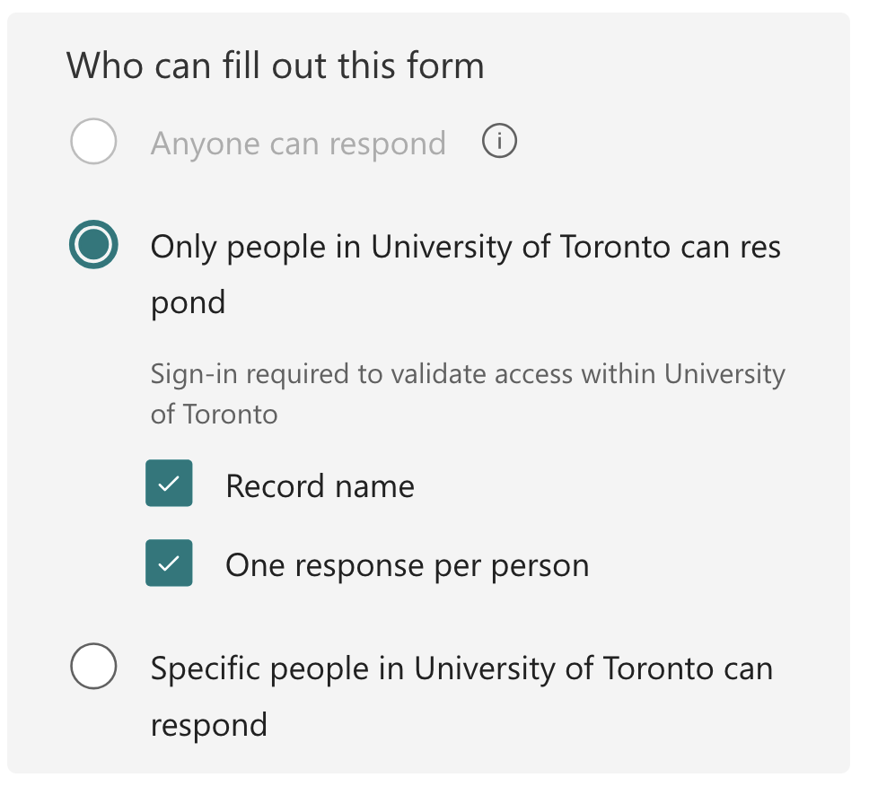
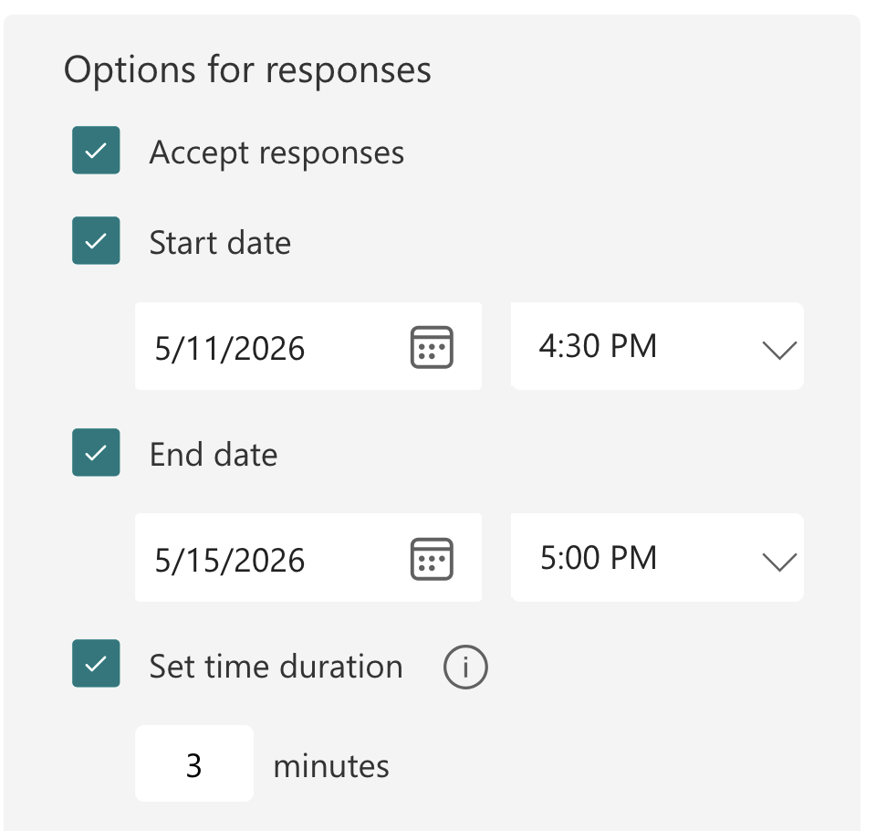
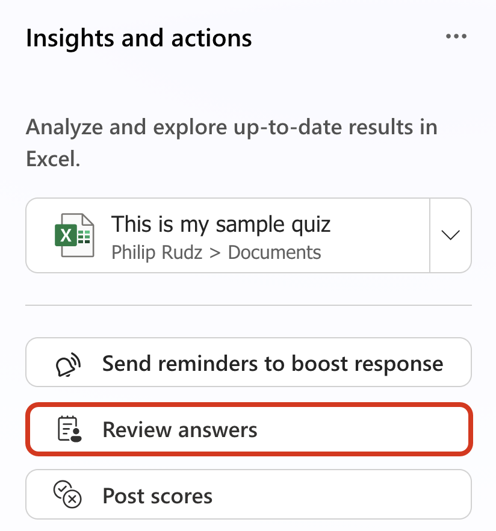
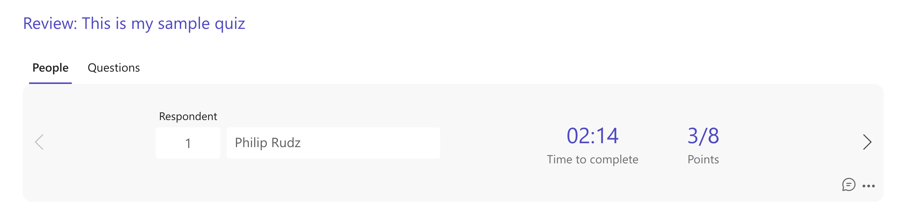
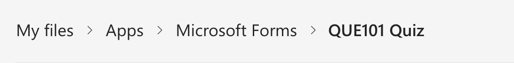

# Using MS Forms for Quizzes

A&S Teaching & Learning (teachinglearning.artsci@utoronto.ca)

[Microsoft Forms](https://forms.cloud.microsoft) includes quizzing capability. It is not as extensive as the quiz tools in Quercus, but it offers multiple choice, text-entry, file upload, ranking question types. You can also embed images or video in question prompts. There is a 'by-quiz' or 'by-question' grading interface and all results can be viewed in a live spreadsheet or exported.

> **Note:** you can use [MS Forms to accept files](https://support.microsoft.com/en-us/office/add-questions-that-allow-for-file-uploads-in-microsoft-forms-6a75a658-c02b-450e-b119-d068f3cba4cf) from students in lieu of Quercus' assignment function - just set up a single question quiz with a "File upload" question; all submissions will have student names (derived from their actual M365 accounts) appended to the uploaded files in your OneDrive folder. You can find uploaded files from quizzes in your OneDrive in the **Apps -> Microsoft Forms [Quiz Name] subfolder**.

### Relevant Features
1. **Question Types:**
    * Multiple Choice and Multiple Answer
    * Text Entry
    * Ranking
    * **File Upload**
        * Uploaded files are found in 'Your OneDrive/Apps/Microsoft Forms/'
        * Student's names are appended to submitted files names
2. Ability to shuffle questions
2. Practice and 'reveal answers immediately' features for formative quizzing
3. Start date, End date and Set time duration features
    * The equivalent of 'Available From', 'Available Until', 'Time Limit' in Quercus
4. Allows respondents to save their submissions
5. Optional email notifications of submissions
6. You can [add collaborators/editors to your quiz or share it as a template](https://support.microsoft.com/en-us/forms/share-a-form-or-quiz-to-collaborate)
7. There is a basic grading interface for questions that need human review
    * you can add comments for feedback though we don't recommend committing to this temporary quizzing platform, any comments you add can be exported
    * you can grade by-question or by-quiz

### Distribution
* Quizzes can force students to log in using their UTORid so all responses are identifiable
* Distribute your quizzes by sharing the (optionally shortened) URL
    * There **is** a feature to limit access to only named individuals, but the interface does not accept a list of student emails so we've found this to be impractical
* Do not use the built-in email tool to distribute your quiz - use [a BCC email](https://support.microsoft.com/en-us/office/show-hide-and-view-the-bcc-blind-carbon-copy-field-in-outlook-for-windows-04304e27-63a2-4276-8884-5077fba0e229) instead - the built-in tool will expose email addresses to all recipients

### Creating a Quiz

Creating quizzes in Forms is intuitive and familiar coming from Quercus. Create a new quiz and add questions, your progress is auto-saved.

Hovering over the questions allows dragging and dropping to re-order them. You can use sections to split your quiz into pages.

#### Quiz Settings

Click settings at the top of the interface

The key to successful quiz on Forms is to configure the settings to mimic Quercus' defaults. 

#### Limiting respondents to U of T users and one response only

#### Response Settings

Unchecking "Accept responses" allows you to close the quiz manually. If the timer elapses, in-progress responses are auto-submitted. We also allow students to save their responses for their review.

> [Read more about quiz settings from Microsoft](https://support.microsoft.com/en-us/office/adjust-your-form-or-quiz-settings-in-microsoft-forms-f255a4ba-e03c-4e12-b880-f7e8b62e0665#bkmk_quizonlysettings)

### Grading

Access the grading interface via 'View Responses'

..then click 'Review answers'
Alternatively, you can view all the responses on the linked spreadsheet.
The post scores option reveals your feedback as well as the grades to students. This is optional as the linked spreadsheet will contains the score for students. 

You can choose between by-quiz and by-question grading by toggling between 'People' and 'Questions'

#### File Upload Location

If you used the File Upload question in your quiz, you can locate the files uploaded by students in your OneDrive under the Apps folder, in the **Apps -> Microsoft Forms [Quiz Name] subfolder**.

### Importing grades to Quercus
There is no automated connection to get grades back to Quercus, you will have to import the grades manually (but [we](mailto:teachinglearning.artsci@utoronto.ca) can help with this). You can import grades using a [gradebook export/import process](https://q.utoronto.ca/courses/242937/pages/using-the-gradebook#importing-and-exporting-the-gradebook) in Quercus.

#### Info
Contact [teachinglearning.artsci@utoronto.ca](mailto:teachinglearning.artsci@utoronto.ca) for additional help.
