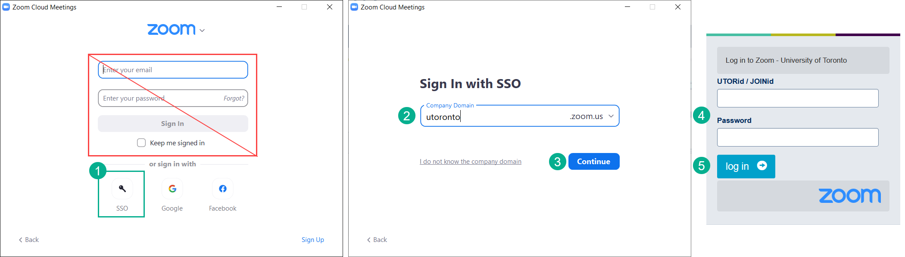
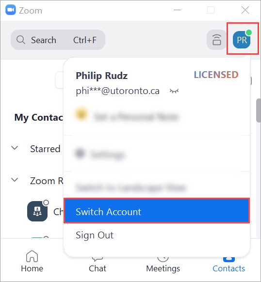

# Zoom at U of T
A&S Teaching & Learning (teachinglearning.artsci@utoronto.ca)

Every member of the U of T community (faculty/staff/students) has access to an "Education" license of Zoom which grants meetings of unlimited length for up to 300 participants. You are also entitled to cloud storage with 365 day retention for recordings.

## Logging in

 Login to [the portal](https://utoronto.zoom.us) using your U of T credentials will activate your license. Once registered through the Zoom portal, you will be able to access your Zoom settings, cloud recordings and polls.[Download and install](https://zoom.us/download) the Zoom client (if you have not already done so).
   
> **What if I cannot log in or encounter an error?** \
> If your UTorID login works for other University services, but you encounter an error when trying to claim your U of T Zoom account, it is likely that you have previously had a paid account associated with your @utoronto.ca email address. If so, you must be manually added to the site license. Contact q.help@utoronto.ca to request that you be manually added. You will receive an email notifying you that you have been invited to the U of T Zoom account.

(1)Select SSO to log in, (2)enter 'utoronto' in the Company Domain field and select (3) **Continue**. In your browser, enter your U of T credentials and select **Log in**

### Managing multiple accounts
If you have another Zoom account you need to use, use the "Switch Account" feature in the desktop client before you join any meetings that require the alternate account.

